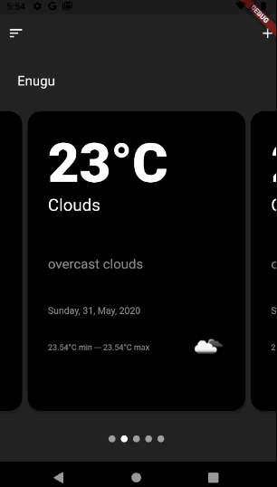

# WeatherMate

A Flutter weather application making use of [OpenWeather api](https://openweathermap.org/api) showing 5 different forecasts.

## Packages
 *[Carousel Slider](https://pub.dev/packages/carousel_slider)
 *[Https](https://pub.dev/packages/http)

## Screenshots

